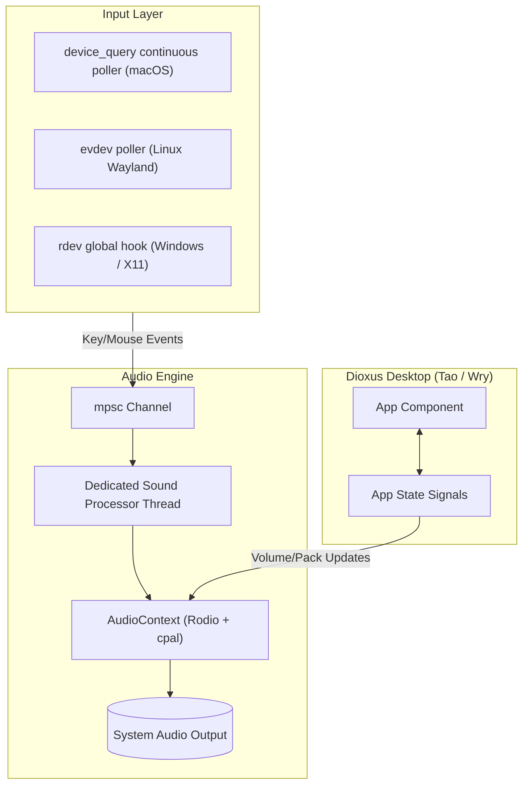

# MechvibesDX — System Architecture & Internals

## 1. High-Level Architecture Diagram

## 2. macOS Input & Permission Architecture
On macOS (Sonoma/Sequoia), standard HID event taps (`CGEventTap`) can cause silent filtering of letter/number keys when permissions are restricted or when background threading issues occur.
MechvibesDX solves this via:
1. **`device_query` Polling**: Runs continuous non-interfering key polling in background threads.
2. **App Nap Disabler**: Disables process sleeping via Objective-C FFI call `[NSProcessInfo beginActivityWithOptions:reason:]`.
3. **Accessibility Permission Monitor**: Checks `AXIsProcessTrusted` native API and renders a real-time warning banner with System Settings shortcut when access is missing.

## 3. Audio Threading Architecture
To achieve ultra-low latency keypress audio without stutter:
- Pre-decoded audio samples are stored in memory (`Arc<Mutex<HashMap<String, Vec<[f32; 2]>>>>`).
- The `sound_processor` thread runs an infinite event loop consuming key events from `mpsc` channels and directly outputting to `cpal` audio sinks.
